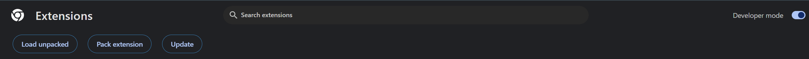
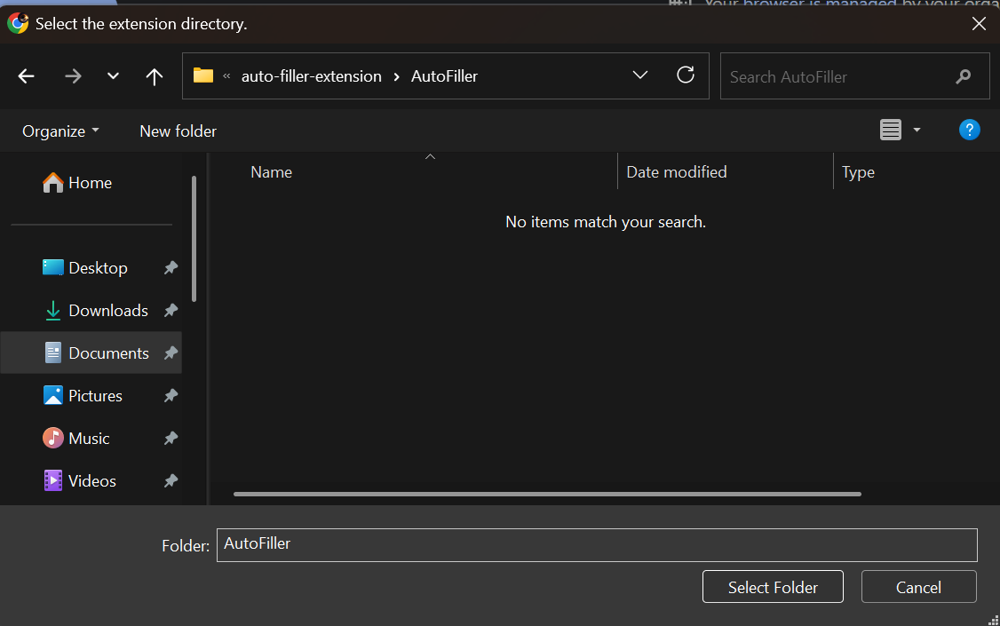
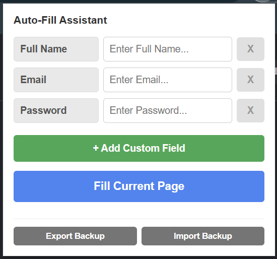

# Custom Auto-Fill Assistant

A lightweight, dynamic Google Chrome extension that allows you to store your form data safely and auto-fill input fields on any webpage with a single click.

---

## Storage & Data Safety (Important)

Your privacy and data persistence are managed automatically based on your browser state:

* **Cloud Sync (Connected):** If you are signed into a Google Account in Chrome, your data is securely synced across your profile. It will survive cache clears and automatically sync if you sign into another computer.
* **Local Storage (Not Connected):** If you are *not* signed into a Google Account, the extension stores your data completely offline on your computer's local hard drive.
* **Cache Warning:** If you are using local storage (not signed into a Google Account) and you completely clear your browser's **"Cookies and other site data"**, your saved auto-fill information **will be permanently deleted**. 
* **Secure Backups:** Use the built-in **Export Backup** button to download a `.json` text file copy of your data to your hard drive so you can restore it anytime if your cache is wiped.

---

## Features
* **Locked Core Template**: Default fields (`Full Name`, `Email`, `Password`) are secure, uneditable, and locked against accidental deletion.
* **Dynamic Field Creation**: Add, rename, or remove as many custom data fields (e.g., Phone, Address, Company) as you need.
* **Password Masking**: Fields containing "Password" automatically obscure text values inside the popup UI.
* **Backup Engine**: Export your configured forms to a tiny `.json` file backup and import them instantly on other devices.

---

## How to Install (Step-by-Step)

Follow these simple steps to install the extension manually using Chrome's Developer Mode:

1. **Download/Clone this project folder** (`AutoFiller`) to your computer.
2. Open Google Chrome and type `chrome://extensions/` into the URL bar, then press Enter.
3. Turn **ON** the **Developer mode** switch toggle in the top-right corner.

4. Click the **Load unpacked** button in the top-left corner.
5. Choose your `AutoFiller` folder.

## Preview

---

## How to Use

1. Click the **Puzzle Piece Icon** in your Chrome browser toolbar (top-right corner).
2. Locate **Auto-Fill Assistant** and click the **Pin Icon** next to it so it stays visible.
3. Click your new extension icon, fill out your default information, or click **+ Add Custom Field** to customize your layout.
4. Navigate to any webpage form (like a signup or login page) and click **Fill Current Page**.

## License
This project is open-source and free to use under the MIT License.
